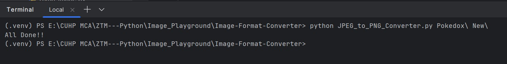
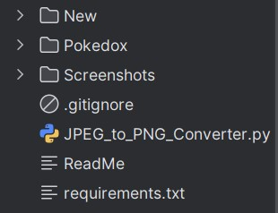
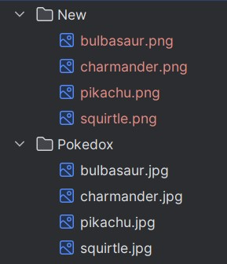

# JPEG-to-PNG-Converter
# JPEG → PNG Batch Converter

A simple Python script to **convert all images in a folder into PNG format**.
Supports **batch processing**, so you can quickly convert multiple files at once.

---

## Features
- Converts supported format JPEG, JPG into PNG.
- Batch conversion of all files in a folder.
- Automatically creates output folder (if not already present).
- Lightweight and beginner-friendly.

---

## Screenshots
- Here’s how the script looks when executed in the terminal:

**1. Running Script


**2. New Folder Created (If not exists)


**3. Converted Images


---

## Installation

1. Clone this repository:

   ```bash
   git clone https://github.com/SHER0088/JPEG-to-PNG-Converter.git
   cd JPEG-to-PNG-Converter
   
2. Install Dependencies:

    ```bash
   pip install -r requirements.txt


